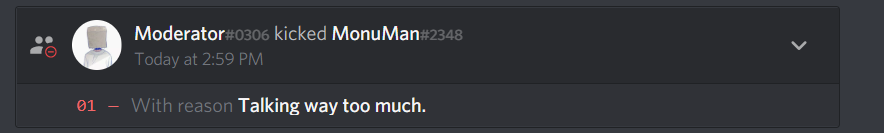
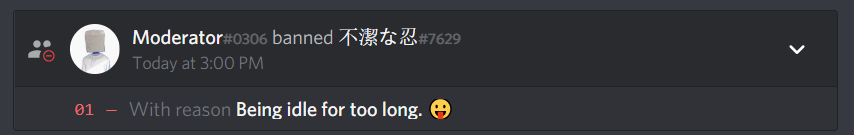

# Discord Moderation Bot

I have build a Discord Moderation Bot for Clinify-Open-Sauce
This refers to Issue #6.

## Installation

Use the following link to invite the bot to your server.

```bash
https://discord.com/api/oauth2/authorize?client_id=867299749438554134&permissions=8&scope=bot
```

## Usage

It has 3 functions:

- Warn => Warns the user by tagging them and deletes the message by any moderator.
- Kick => Kicks the user and also logs a reason.
- Ban => Bans the user and logs a reason.

The prefix for the bot is "m."

Use "m.help" for the default help menu.

## #whoami

Shubhayu Majumdar

BlueLearn Discord ID:

```bash
Shubhayu#3788
```

Prototype Video:

```bash
https://drive.google.com/file/d/1UQYkmriYl3qjAOWfN-nn5o_Ikf_epI59/view?usp=sharing
```

Images:





## Build with Python and <3
